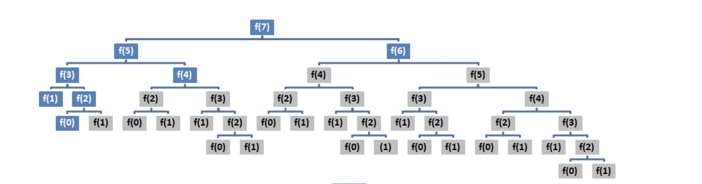
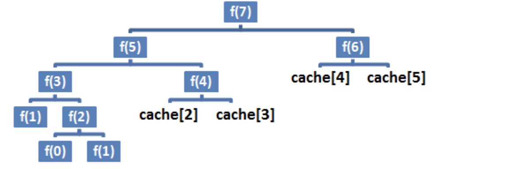
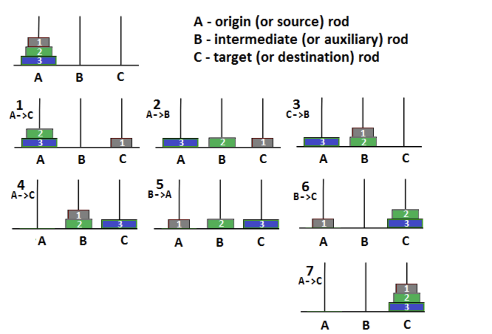
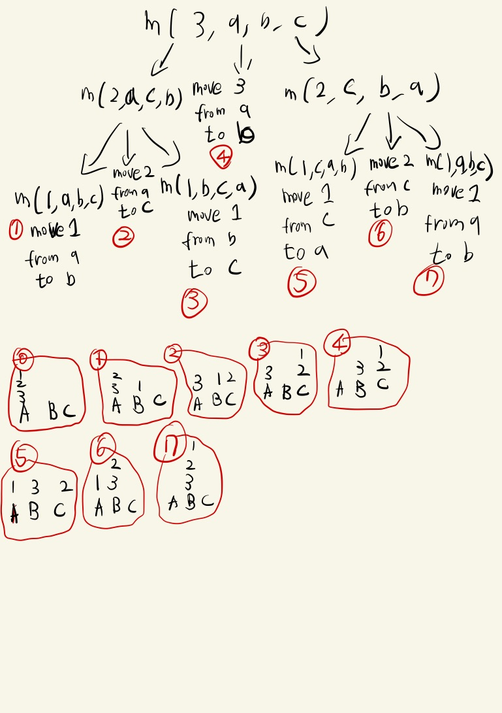

# 8. 재귀 및 동적 프로그래밍 

## 8.1 재귀의 개요 

---


- 직접 또는 간접적으로 스스로를 호출하는 메서드를 재귀 메소드라고 부른다 . 

```java
int fibo(int k){
    // 종료 조건
    if(k <= 1){
        return k;
    }
    // 재귀 호출 
    return fibo(k-2) + fibo(k-1); 
}
```
- 종료 조건 : 후속 재귀 호출 없이 값을 반환 

- 재귀호출 : fibo 메서드가 자신을 스스로 호출 하기 때문에, 재귀 메서드 라고 할수 있다. 

- 재귀 문제 인식하기 
> 문제를 해결하기 전, 해당 알고리즘에 재귀가 정말 적합한 방법인지 파악해야 한다.  
> 피보나치수, 숫자 목록 합계, 최대 공약수, 팩토리얼, 재귀 이진 검색, 문자열 반전 과 같은 문제의 공통점은 재귀문제는 하위 문제로 구성 될수 있다는 점이다. 즉, 메서드가 반환한 값을 해당 메서드가 반환한 다른 값으로 표현 할 수 있다.  
> 피보나치 문제를 예를 들게 되면 fibo(8) = fibo(7) + fibo(6) 으로 표현 할수 있고, 해당 사실을 통하여 우리는 피보나치 문제를 해결하기전 해당 알고리즘이 재귀가 적합한 방식이라는 사실을 파악 할수 있다.  
---

## 7.2 동적 프로그래밍의 개요 

---

- 동적 프로그램은 재귀 최적화를 말하는 것과 동일하다.
 즉, 우리가 재귀 문제를 만났을 경우는 평범한 재귀 알고리즘을 사용 할수 있고, 동적 프로그래밍을 사용하여 해결 할수도 있다. 

 - 위에서 피보나치 수열을 다시 떠올려 보자, 빅오표기법을 통하여 실행시간을 표기하면 O(2의 n승) 이다. 해당 실행 시간은 효과적인 성능과 거리가 매우 멀다는 사실을 알수 있고 도표를 참고 해보면  끔찍한 성능의 영역에 있다. 
 
 - 우리는 메모이제이션 접근법을 사용하여 해당 알고리즘의 성능을 향상 시킬수 있다.  
 
  
---

## 메모이제이션
---

- 재귀 알고리즘이 동일한 입력에 관해 호출을 반복 한다면 알고리즘이 중복된 작업을 한다는 의미 이며, 다시 말해 재귀 문제에는 중복되는 하위 문제가 존재하며, 문제 해결 과정에서 동일한 하위 문제를 여러번 푼다는 사실이다. 
- 해당 문제를 해결하기 위하여 메모이제이션(하향식 동적 프로그래밍)은 해당 문제(중복 작업)를 해결하기위하여 사용하는 방식이다.
- 메모이 제이션은 동일한 입력에 관해 메서드를 한번만 호출하도록 보장한다, 이를 위하여 주어진 입력에 대한 결과를 저장한다.  
- 중복 작업이 많은 피보나치에 관하여 메모이제이션으로 해결한 방식을 살펴보자 
```java
    int fibo(int k){
        return fibo(k, new int[k+1]);
    }
    int fibo(int k, int[] cache){
        if(k <= 1)
            return k;
        else if (cahce[k] > 0)
            return cache[k];
    
        cache[k] = fibo(k-2,cache) + fibo(k-1, cache);

        return cache[k];
    }
```
- 메모이제이션은 하향식 접근법이라고 한다. 하향식 접근법은 작은 풀이법으로 개발하는 방법을 설명하고, 최종 풀이법을 개발하기 때문에 직관적이지 않다. 

---

## 태뷸레이션

---
- 태뷸레이션(상향식 접근법)은 하향식 접근법 보다 직관적이다. 재귀 알고리즘은 기본적으로 끝에서 시작해 역방향으로 작동하지만, 상향식 알고리즘은 앞에서 시작한다. 상향식 접근법은 재귀 알고리즘의 단점을 방지하고, 공간 복잡도를 줄인다. 

```java
    int fibo(int k){
        if (k <= 1 )
            return k;
        
        int first = 1;
        int second = 0;
        int result = 0;

        for(int i = 1; i< k; i++){
            result = first + second;
            second = first;
            first = result;
        }
        return result;
    }
```
---

## 8.3.2 하노이의 탑 
---
```java
   public static void moveDisks(int n, char origin, char target, char intermediate) {
        if (n <= 0) {
            return;
        }

        if (n == 1) {
            System.out.println("Move disk 1 from rod " + origin + " to rod " + target);
            return;
        }

        // 원점 막대의 상위 n − 1개 원반을 중간 막대로 옮기고, 대상 막대를 중간 막대 역할로 활용합니다.
        moveDisks(n - 1, origin, intermediate, target);

        System.out.println("Move disk " + n + " from rod " + origin + " to rod " + target);

        // 중간 막대의 상위 n − 1개 원반을 대상 막대로 옮기고, 원점 막대를 중간 막대 역할로 활용합니다.
        moveDisks(n - 1, intermediate, target, origin);
    }
```
- 하노이탑 문제를 재귀 문제로 판단 할수 있는 이유 
    - 하노이탑은 결국 상단 (n-1) 개의 탑을 도움 막대로 옮긴뒤, 1개의 탑을 대상 막대로 옮긴뒤, 도움막대에 존재하는 n-1 개의 탑을 대상 막대로 옮기면 되기 떄문에(n-1개 의 막대를 대상 막대로 옮기는 과정도 결국 재귀적으로 구성된다.)

- 3단계를 예시로 문제 풀이  


---

## 영역구하기
---
- 영역 구하기 문제를 재귀 문제로 판단 할수 있는 이유 
    - 같은색의 영역을 확인할때, 임의의 지점에서의 값을 구하기 위하여 연결된 같은 색깔의 값 +1 이기 때문에 재귀로서 판단할수 있다.  
```java
private int currentColorSpot;

    void determineBiggestColorSpot(int cols, int rows, int a[][]) {
        if (a == null) {
            throw new IllegalArgumentException("The matrix a cannot be null");
        }

        if (cols <= 0 || rows <= 0) {
            throw new IllegalArgumentException("Grid cannot have 0 rows and/or cols!");
        }

        int biggestColorSpot = 0;
        int color = 0;

        for (int i = 0; i < rows; i++) {
            for (int j = 0; j < cols; j++) {
                if (a[i][j] > 0) {
                    currentColorSpot = 0;
                    computeColorSpot(i, j, cols, rows, a, a[i][j]);

                    if (currentColorSpot > biggestColorSpot) {
                        biggestColorSpot = currentColorSpot;
                        color = a[i][j] * (-1);
                    }
                }
            }
        }
        System.out.println("\nColor: " + color + " Bigest spot: " + biggestColorSpot);
    }

    private void computeColorSpot(int i, int j, int cols, int rows, int a[][], int color) {
        a[i][j] = -a[i][j];
        currentColorSpot++;

        if (i > 1 && a[i - 1][j] == color) {
            computeColorSpot(i - 1, j, cols, rows, a, color);
        }

        if ((i + 1) < rows && a[i + 1][j] == color) {
            computeColorSpot(i + 1, j, cols, rows, a, color);
        }

        if (j > 1 && a[i][j - 1] == color) {
            computeColorSpot(i, j - 1, cols, rows, a, color);
        }

        if ((j + 1) < cols && a[i][j + 1] == color) {
            computeColorSpot(i, j + 1, cols, rows, a, color);
        }
    }
```
---

## 5개의 탑 
---
- 재귀 및 동적 프로그래밍에 있는 부분이기 때문에, 재귀의 해설을 복사 해왔지만, 사실 이부분을 왜 재귀로 풀어야 하는지는 이해가 되지 않는다, 해당 부분은 스터디 할때 다른 분들의 의견을 들어보고 싶다 .  
```java
protected static final int GRID_SIZE = 5; // (5×5)

    private FiveTower() {
        throw new AssertionError("Cannot be instantiated");
    }

    public static void buildTowers(int row, Integer[] columns, Set<Integer[]> solutions) {
        if (row < 0) {
            throw new IllegalArgumentException("The row cannot be negative");
        }

        if (columns == null || columns.length != GRID_SIZE) {
            throw new IllegalArgumentException("The columns array length must be " + GRID_SIZE);
        }

        if (solutions == null) {
            throw new IllegalArgumentException("The solutions array cannot be null");
        }

        if (row == GRID_SIZE) {
            solutions.add(columns.clone());
        } else {
            for (int col = 0; col < GRID_SIZE; col++) {
                if (canBuild(columns, row, col)) {
                    // 탑을 세웁니다.
                    columns[row] = col;

                    // 다음 행으로 넘어갑니다.
                    buildTowers(row + 1, columns, solutions);
                }
            }
        }
    }

    private static boolean canBuild(Integer[] columns, int nextRow, int nextColumn) {
        for (int currentRow = 0; currentRow < nextRow; currentRow++) {
            int currentColumn = columns[currentRow];

            // 다른 탑과 같은 열에 탑을 세울 수 없습니다.
            if (currentColumn == nextColumn) {
                return false;
            }

            int columnsDistance = Math.abs(currentColumn - nextColumn);
            int rowsDistance = nextRow - currentRow;

            // 다른 탑과 같은 대각선에 탑을 세울 수 없습니다.
            if (columnsDistance == rowsDistance) {
                return false;
            }
        }

        return true;
    }
```
---

## 떨어지는 공 
---
```java
public static void computePath(int prevElevation, int i, int j, int rows, int cols, int[][] elevations) {
		if (elevations == null) {
			throw new IllegalArgumentException("Elevations cannot be null");
		}

		// 공이 격자 지도의 영역 안에 있는지 확인합니다.
		if (i >= 0 && i <= (rows - 1) && j >= 0 && j <= (cols - 1)) {
			int currentElevation = elevations[i][j];

			// 공이 이전 칸에서 현재 칸으로 떨어질 수 있는지 확인합니다.
			if (prevElevation >= currentElevation && currentElevation > 0) {
				// 다음 이동을 계산할 때 사용하기 위해 현재 고도를 저장합니다.
				prevElevation = currentElevation;

				// 이 칸을 방문했다고 표시합니다.
				elevations[i][j] = 0;

				// 공을 이동할 수 있는지 확인합니다.
				computePath(prevElevation, i, j - 1, rows, cols, elevations);
				computePath(prevElevation, i - 1, j, rows, cols, elevations);
				computePath(prevElevation, i, j + 1, rows, cols, elevations);
				computePath(prevElevation, i + 1, j, rows, cols, elevations);
			}
		}
	}

	public static void main(String[] args) {
		int cols = 5;
		int rows = 5;

		// 각 영역은 고도에 해당하는 1, 2, 3, 4, 5(가장 높음)라는 값을 갖습습니다.
		int elevation = 5;

		Random rnd = new Random();

		int[][] elevations = new int[rows][cols];

		// 임의의 고도를 추가합니다.
		for (int i = 0; i < rows; i++) {
			for (int j = 0; j < cols; j++) {
				elevations[i][j] = 1 + rnd.nextInt(elevation);
			}
		}

		// 화면에 각 격자 영역에 들어 있는 고도의 값을 표시합니다.
		System.out.println("Initial grid:");
		for (int i = 0; i < rows; i++) {
			for (int j = 0; j < cols; j++) {
				System.out.format("%2s", elevations[i][j]);
			}

			System.out.println();
		}

		System.out.println("Middle cell has elevation: " + elevations[rows / 2][cols / 2]);
		FallingBall.computePath(elevations[rows / 2][cols / 2], rows / 2, cols / 2, rows, cols, elevations);

		System.out.println("Result grid:");
		for (int i = 0; i < rows; i++) {
			for (int j = 0; j < cols; j++) {
				System.out.format("%2s", elevations[i][j]);
			}

			System.out.println();
		}
	}
```

---

## 문자열 순열 

---
```java
public static Set<String> permute(String str) {
			if (str == null || str.isBlank()) {
				// 혹은 throw IllegalArgumentException 발생
				return Collections.emptySet();
			}

			return permute("", str);
		}

		private static Set<String> permute(String prefix, String str) {
			Set<String> permutations = new HashSet<>();

			int n = str.length();

			if (n == 0) {
				permutations.add(prefix);
			} else {
				for (int i = 0; i < n; i++) {
					permutations.addAll(permute(prefix + str.charAt(i), str.substring(i + 1, n) + str.substring(0, i)));
				}
			}

			return permutations;
		}
```
---

## 중괄호 여닫기 

---
```java

    public static List<String> embrace(int n) {
        if (n <= 0) {
            return Collections.emptyList();
        }

        List<String> results = new ArrayList<>();
        embrace(n, n, new char[n * 2], 0, results);

        return results;
    }

    private static void embrace(int leftHand, int rightHand,
      char[] str, int index, List<String> results) {
        if (rightHand < leftHand || leftHand < 0) {
            return;
        }

        if (leftHand == 0 && rightHand == 0) {
            // 유효한 조합을 찾았기 때문에 저장합니다.
            results.add(String.valueOf(str));
        } else {
            // 왼쪽 중괄호를 추가합니다.
            str[index] = '{';
            embrace(leftHand - 1, rightHand, str, index + 1, results);

            // 오른쪽 중괄호를 추가합니다.
            str[index] = '}';
            embrace(leftHand, rightHand - 1, str, index + 1, results);
        }
    }
```
---

## 부분 집합 합계 

---
```java

    // 재귀 알고리즘 접근법
    public static void findSumRecursive(int[] arr, int index,
      int currentSum, int givenSum, int[] subset) {
        if (arr == null || arr.length == 0
          || index < 0 || currentSum < 0 || givenSum < 0
          || subset == null || subset.length != arr.length) {
            throw new IllegalArgumentException("The given argument(s) are wrong");
        }

        if (currentSum == givenSum) {
            System.out.print("\nSubset found: ");
            for (int i = 0; i < subset.length; i++) {
                if (subset[i] == 1) {
                    System.out.print(arr[i] + " ");
                }
            }
        } else if (index != arr.length) {
            subset[index] = 1;
            currentSum += arr[index];

            findSumRecursive(arr, index + 1, currentSum, givenSum, subset);

            currentSum -= arr[index];
            subset[index] = 0;

            findSumRecursive(arr, index + 1, currentSum, givenSum, subset);
        }
    }

    // 동적 프로그래밍 접근법(상향식)
    public static boolean findSumDP(int[] arr, int givenSum) {
        if (arr == null || arr.length == 0 || givenSum < 0) {
            throw new IllegalArgumentException("The given argument(s) are wrong");
        }

        boolean[][] matrix = new boolean[arr.length + 1][givenSum + 1];

        // 첫 번째 행을 초기화합니다.
        for (int i = 1; i <= givenSum; i++) {
            matrix[0][i] = false;
        }

        // 첫 번째 열을 초기화합니다.
        for (int i = 0; i <= arr.length; i++) {
            matrix[i][0] = true;
        }

        for (int i = 1; i <= arr.length; i++) {
            for (int j = 1; j <= givenSum; j++) {
                // 먼저, 이전 행에서 값을 복사합니다.
                matrix[i][j] = matrix[i - 1][j];

                // matrix[i][j]가 false면 현재 행의 값이 F인지 T인지 계산합니다.
                if (matrix[i][j] == false && j >= arr[i - 1]) {
                    matrix[i][j] = matrix[i][j] || matrix[i - 1][j - arr[i - 1]];
                }
            }
        }

        printSubsetMatrix(arr, givenSum, matrix);
        printOneSubset(matrix, arr, arr.length, givenSum);

        return matrix[arr.length][givenSum];
    }

    private static void printOneSubset(boolean[][] matrix, int[] arr, int row, int col) {
        int i = row;
        int j = col;

        System.out.println("\nSubset: ");
        while (i > 0 && j >= 0) {
            int value = arr[i - 1];
            if (j - value >= 0 && matrix[i - 1][j - value] && !matrix[i - 1][j]) {
                i = i - 1;
                j = j - value;
                System.out.print(value + " ");
            } else {
                i--;
            }
        }
    }

    private static void printSubsetMatrix(int[] arr, int givenSum, boolean matrix[][]) {
        System.out.println("\nSubset matrix for sum " + givenSum + ": ");
        System.out.print("\t");
        for (int j = 0; j <= givenSum; j++) {
            System.out.print(j + "\t");
        }

        System.out.println();

        for (int i = 0; i <= arr.length; i++) {
            System.out.print(i == 0 ? 0 + "\t" : arr[i - 1] + "\t");
            for (int j = 0; j <= givenSum; j++) {
                System.out.print(matrix[i][j] ? "T\t" : "F\t");
            }

            System.out.println();
        }
    }
``` 
---